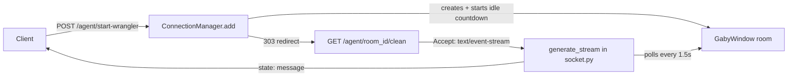

# Gaby Explore/Exploit Manager

[](.github/workflows/test.yml)
[](LICENSE)
[](https://python.org)

FastAPI SSE transport server for self-directed data cleaning agent, Gaby. Implementation leverages classical decision-making algorithms to assist a single running LLM agent's reasoning loop, aligned with the same cognitive behavior driving chain-of-responsibility data pipelines (e.g. ETL workflows).

> A repository rename has been discussed (`databy-cognition` was one proposal) but nothing has been finalized — commands below use the current, real repository name and URL.

## Highlights

- **Key Feature**:
  - **Cognitive engine** (`core/cognitive.py`): a `CognitiveAction` dataclass holds normalized `exploit`/`explore` probabilities (default 0.95/0.05). Seven reasoning states are scaffolded as small `Spine`-based agents — narrate, exploit, explore, plan, revise, question, contradict — each bound to its own prompt. **Not yet wired**: `Cognitive.run_background()` currently only ever invokes `narrate`; nothing yet samples from the `exploit`/`explore` probabilities to choose between states.
  - **Chain-of-responsibility pipeline** (`core/pipeline.py`): `ChainStage`/`DataPipeline` define a stage-chaining contract (`forward()` validates output, updates agent state, forwards to the next stage). `DataPipeline.__init_subclass__` is meant to auto-wire a whole pipeline from a class-keyword argument, but its signature (`kwargs`) doesn't match the `chain=OrderedDict(...)` form shown in its own docstring, so that usage currently raises `TypeError`. In practice, the real data-exploration pipeline (`pipelines/data_explorer.py`: `DefineDataset → DescribeDataset → DataTyperStage`) is wired by hand via `dataclass.__post_init__` calling `set_next_stage()`, not through `__init_subclass__`.
  - **SSE "agent room" broadcasting** (`api/socket.py`): each session is a `GabyWindow` room keyed by UUID, created via `POST /agent/start-wrangler`. `generate_stream()` polls `room.agent.state_message` every 1.5s and yields it as `state: ...\n\n` — a non-standard SSE field name, so it won't populate a browser `EventSource.onmessage` handler, which only fires on `data:` fields. `ConnectionManager` (`api/utils/manager.py`) owns room storage and a 20-minute idle-timeout countdown, but `_countdown()`'s call into `remove()` tries to cancel-and-await its own currently-running task, which raises before the room is actually deleted — so idle rooms aren't currently evicted despite the timer firing.
  - `app/agent/memory/gatekeeper.py` provides Hugging Face and Kaggle dataset search helpers (`search_hugging_dataset`, `search_kaggle_dataset`); it does not implement a memory/episodic-storage pattern.
  - Environment-aware configuration: a nested frozen-dataclass `AgentBuild` tree loads different YAML model catalogues for dev vs. prod.
- **Notes**:
    - This project was built and extended across AWS and Google hackathons. Once an AI provider is selected, the agent's sandbox can run on:
        - AWS (SageMaker/Bedrock/S3)
        - GCP BigQuery
    - Intended future integration connectors: MongoDB, Redis, LiveKit, Notion, Hugging Face, Kaggle.
- **Known issues**:
  - `tests/test_main.py` still expects a JSON payload from `GET /`, but `app/main.py`'s root route now redirects to `/docs` — that test currently fails and the root endpoint isn't a verified contract.
  - CI (`.github/workflows/test.yml`) installs `requirements.txt` but never installs `ruff`, so the lint step fails with `ruff: command not found` before pytest runs (pre-existing, unrelated to any README change).
  - A clean install via `pip install -e ".[dev,test]"` doesn't pull in `huggingface_hub`/`kaggle`, which `app.agent.memory.gatekeeper` imports at module load time — importing `app.main` fails without installing them separately.
- **Results & Conclusion**:
  - The chain-of-responsibility *contract* (`ChainStage.forward`/`validate_stage_output`) is a clean, reusable shape for pipeline stages, but the self-registering `__init_subclass__` convenience layer on top of it isn't functional yet — stages are still wired by hand.
  - The cognitive engine's state/probability scaffolding is in place, but the actual explore/exploit decision loop (sampling a state to run based on `CognitiveAction`) still needs to be implemented.
  - Next: fix the `_countdown`/`remove` self-await bug, switch `generate_stream()` to standard `data:` SSE fields, and either implement `Cognitive`'s state-selection loop or keep documenting it as not-yet-wired rather than as an achieved feature.

## Project Directory Overview

```text
databy-socket/
├── .github/workflows/test.yml     # CI: ruff + pytest across Python 3.12/3.13 (ruff install currently missing)
├── app/
│   ├── main.py, cli.py            # FastAPI app assembly, `databy serve` CLI
│   ├── api/
│   │   ├── socket.py              # SSE agent-window + start-wrangler endpoint (generate_stream lives here)
│   │   ├── utils/manager.py       # ConnectionManager (room storage, idle-timeout — eviction currently buggy)
│   │   └── datasource.py, dashboard.py, mongodb.py, auth.py
│   ├── agent/
│   │   ├── main.py                # GabyAgent state model, GabyWindow session
│   │   ├── core/
│   │   │   ├── cognitive.py       # cognitive state scaffolding (narrate/exploit/explore/plan/revise/question/contradict)
│   │   │   └── pipeline.py        # ChainStage contract + DataPipeline self-registration scaffold
│   │   ├── memory/                # gatekeeper.py (HF/Kaggle dataset search helpers), manager.py
│   │   ├── pipelines/             # data_explorer.py (DefineDataset→DescribeDataset→DataTyperStage), data_wrangler.py, records.py
│   │   └── outbounds/             # aws/, bigquery/, lightning.py adapters
│   └── utils/settings.py          # AgentBuild dataclass config tree
├── tests/                         # agent/ and api/ coverage, incl. test_socket.py (largest suite); test_cli.py is empty
├── conftest.py, pyproject.toml, justfile
└── Dockerfile
```

## System Architecture



The Cognitive engine and `ChainStage` pipeline are not yet invoked from this request path — today a room only tracks `room.agent.state_message`, which something else must set. Wiring the Cognitive loop and the `DataExplorer`/data-wrangling pipelines into this flow is the next integration step, not a shipped behavior.

## Dev Notes

- **Installation**:

    ```bash
    # Clone the repository
    git clone https://github.com/whoamimi/databy-socket.git
    cd databy-socket

    # Create and activate environment
    conda create -n databy-socket python=3.12 -y
    conda activate databy-socket

    # Install package + dev/test extras
    pip install -e ".[dev,test]"

    # app/agent/memory/gatekeeper.py needs these at import time;
    # they aren't declared in pyproject.toml yet
    pip install huggingface_hub kaggle

    cp .env.example .env
    ```

- **To start**:

    ```bash
    databy serve
    # or directly
    uvicorn app.main:app --reload
    ```

## Citation

If you use this software in your work, please cite it as follows:

```bibtex
@software{mimi2026databysocket,
  author = {Mimi},
  title  = {databy-socket: a cognitive-engine and chain-of-responsibility pipeline scaffold for the Gaby data-cleaning agent},
  year   = {2026},
  url    = {https://github.com/whoamimi/databy-socket}
}
```
