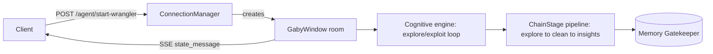

# Gaby Explore/Exploit Manager

[](LICENSE)
[](https://python.org)
[](.github/workflows/test.yml)

FastAPI SSE transport server for self-directed data cleaning agent, Gaby. Implementation leverages classical decision making algorithms to assist single running LLM agent's reasoning loop, which aligns with the same cognitive behavior in driving chain-of-responsibility in building data pipelines e.g. ETL workflows.

## Highlights

- **Key Feature**:
  - **Cognitive engine** (`core/cognitive.py`): a `CognitiveAction` policy holds `exploit`/`explore` probabilities (initial state is default to 0.95 and 0.05 proba, respectively). This code design ensures all cognitive states is implemented as a function with defined pre and post validations/guardrails. Cognitive states:
      - narrate
      - exploit
      - explore
      - plan
      - revise
      - question (doubt)
      - contradict (critic, negative)
  - **Chained states** (`core/pipeline.py`): `ChainBuilder`/`ChainStage`/`DataPipeline` thread a `SessionProfiler` through ordered stages in reasoning and building data pipelines. For example: explore → clean → insights, where each stage validates its output before forwarding to the next.
  - **SSE "agent room" broadcasting** (`api/socket.py`, `api/utils/manager.py`): each session is a `GabyWindow` room keyed by UUID; a `ConnectionManager` tracks rooms with idle-timeout auto-eviction (20 min) and serves state as an `Accept: text/event-stream` feed.
  - Environment-aware configuration: a nested frozen-dataclass `AgentBuild` tree loads different YAML model catalogues for dev vs. prod, plus a Memory subsystem (`agent/memory/gatekeeper.py`) echoing the Memory Gatekeeper pattern from `databy-bq`.
- **Notes**:
    - This project was built and extended from AWS & Google Hackathons. event of hackathons. Once AI provider is defined, the user can select the appropriate cloud service as agent's sandbox:
        - AWS (SageMaker/Bedrock/S3)
        - GCP BigQuery
    - This codebase was intended to be extended as integration connector to:
      - MongoDB
      - Redis
      - LiveKit
      - Notion
      - Hugging Face
      - Kaggle
- **Results & Conclusion**:
  - The cognitive states could be optimized for the way they are defined in the system prompts to agents.
  - The chain-of-responsibility pipeline plus self-registering `DataPipeline.__init_subclass__` gives a genuinely composable way to add new cleaning stages without touching a central dispatcher.

## Project Directory Overview

```text
databy-socket/
├── .github/workflows/test.yml     # CI: ruff + pytest across Python 3.12/3.13
├── app/
│   ├── main.py, cli.py            # FastAPI app assembly, `databy serve` CLI
│   ├── api/
│   │   ├── socket.py              # SSE agent-window + start-wrangler endpoint
│   │   ├── utils/manager.py       # ConnectionManager (rooms, idle-timeout)
│   │   └── datasource.py, dashboard.py, mongodb.py, auth.py
│   ├── agent/
│   │   ├── main.py                # GabyAgent state model, GabyWindow session
│   │   ├── core/
│   │   │   ├── cognitive.py       # explore/exploit reasoning loop
│   │   │   └── pipeline.py        # ChainBuilder/ChainStage/DataPipeline
│   │   ├── memory/                # gatekeeper.py, manager.py
│   │   ├── pipelines/             # data_explorer.py, data_wrangler.py, records.py
│   │   └── outbounds/             # aws/, bigquery/, lightning.py adapters
│   └── utils/settings.py          # AgentBuild dataclass config tree
├── tests/                         # mirrors app/, incl. test_socket.py (largest suite)
├── conftest.py, pyproject.toml, justfile
└── Dockerfile
```

## System Architecture



Every `ChainStage.forward()` call validates its stage's output, updates the room's agent state, and recursively forwards to the next stage; `DataPipeline.__init_subclass__` wires a whole pipeline together from an `OrderedDict` of stage classes at subclass-definition time, and self-registers into a class-level services registry so new pipelines are addressable without a central switch statement.

## Dev Notes

- **Installation**:

    ```bash
    # Clone the repository
    git clone https://github.com/whoamimi/gaby-decision-making.git
    cd gaby-decision-making

    # Create and activate environment
    conda create -n databy-cognition python=3.12 -y
    conda activate databy-cognition

    # Install dependencies
    pip install -e ".[dev,test]"
    cp .env.example .env
    ```

- **To start**:

    ```bash
    databy serve
    # or directly
    uvicorn app.main:app --reload
    ```
    
## Citation

If you use this software in your work, please cite it as follows:

```bibtex
@software{mimi2026databycognition,
  author = {Mimi},
  title  = {gaby-decision-making: an explore/exploit cognitive engine and pipeline platform for the Gaby data-cleaning agent},
  year   = {2026},
  url    = {https://github.com/whoamimi/gaby-decision-making}
}
```
