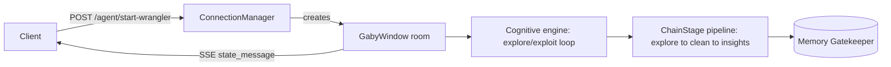

# databy-cognition

*(recommended rename of `databy-socket` — the repo's transport is SSE "agent rooms," not raw sockets; its real center of gravity is the Cognitive explore/exploit engine)*

[](LICENSE)
[](https://python.org)
[](.github/workflows/test.yml)

The most complete build of **Gaby**, my self-directed data-cleaning agent: a FastAPI platform where a Cognitive explore/exploit reasoning loop drives a chain-of-responsibility data pipeline, broadcasting its live state over per-session SSE "rooms," backed by real CI and test coverage.

## Highlights

- **Objective**: consolidate the earlier `databy-cortex` (bandit policy) and `databy-sse` (pipeline, streaming) experiments into one coherent, testable backend — a single autonomous agent that explores/exploits its way through a dataset without a human writing prompts at each step.
- **Key Feature**:
  - **Cognitive engine** (`core/cognitive.py`) — a `CognitiveAction` policy holds `exploit`/`explore` probabilities (default 0.95/0.05, renormalized via numpy on every adjustment) driving seven parallel reasoning "states" — narrate, contradict, exploit, explore, plan, revise, question — each a small `Spine`-based agent bound to its own YAML prompt.
  - **Chain-of-responsibility pipeline** (`core/pipeline.py`) — `ChainBuilder`/`ChainStage`/`DataPipeline` thread a `SessionProfiler` through ordered stages (explore → clean → insights), each stage validating its output and advancing agent state before forwarding to the next.
  - **SSE "agent room" broadcasting** (`api/socket.py`, `api/utils/manager.py`) — each session is a `GabyWindow` room keyed by UUID; a `ConnectionManager` tracks rooms with idle-timeout auto-eviction (20 min) and serves state as an `Accept: text/event-stream` feed.
  - Environment-aware configuration: a nested frozen-dataclass `AgentBuild` tree loads different YAML model catalogues for dev vs. prod, plus a Memory subsystem (`agent/memory/gatekeeper.py`) echoing the Memory Gatekeeper pattern from `databy-bq`.
- **Tech stack**: FastAPI + Uvicorn (uvloop/httptools), Typer/argparse CLI (`databy serve`), Ollama for local LLM inference, pydantic-settings, thin adapter stubs toward AWS (SageMaker/Bedrock/S3), GCP BigQuery, MongoDB, Redis, LiveKit, Notion, Hugging Face, and Kaggle. Packaged as a proper installable project (`pyproject.toml`, `cookiecutter-pypackage` scaffold, `justfile` dev commands).
- **Evaluation**: a real GitHub Actions matrix (Python 3.12 / 3.13) runs `ruff check` then `pytest` on every push/PR; locally, `just qa` runs formatting, linting, type-checking (`ty`), and tests, and `just coverage` produces an HTML coverage report. `tests/api/test_socket.py` (the largest test file in the repo) covers the SSE/room lifecycle directly; note that `tests/test_main.py` currently expects a JSON root response while `app/main.py` actually redirects `/` to `/docs` — a known drift between test and implementation.
- **Results & Conclusion**:
  - The chain-of-responsibility pipeline plus self-registering `DataPipeline.__init_subclass__` gives a genuinely composable way to add new cleaning stages without touching a central dispatcher.
  - Running CI + coverage on a solo sandbox project caught real drift (the `/` route test above) that would otherwise have gone unnoticed — worth keeping as the template for future Gaby sandboxes.
  - Next: reconcile the failing root-route assertion, then decide which of the many thin cloud adapters (AWS/GCP/Mongo/Redis/LiveKit) actually gets built out versus retired as scope creep.

## Project Directory Overview

```text
databy-socket/
├── .github/workflows/test.yml     # CI: ruff + pytest across Python 3.12/3.13
├── app/
│   ├── main.py, cli.py            # FastAPI app assembly, `databy serve` CLI
│   ├── api/
│   │   ├── socket.py              # SSE agent-window + start-wrangler endpoint
│   │   ├── utils/manager.py       # ConnectionManager (rooms, idle-timeout)
│   │   └── datasource.py, dashboard.py, mongodb.py, auth.py
│   ├── agent/
│   │   ├── main.py                # GabyAgent state model, GabyWindow session
│   │   ├── core/
│   │   │   ├── cognitive.py       # explore/exploit reasoning loop
│   │   │   └── pipeline.py        # ChainBuilder/ChainStage/DataPipeline
│   │   ├── memory/                # gatekeeper.py, manager.py
│   │   ├── pipelines/             # data_explorer.py, data_wrangler.py, records.py
│   │   └── outbounds/             # aws/, bigquery/, lightning.py adapters
│   └── utils/settings.py          # AgentBuild dataclass config tree
├── tests/                         # mirrors app/, incl. test_socket.py (largest suite)
├── conftest.py, pyproject.toml, justfile
└── Dockerfile
```

## System Architecture



Every `ChainStage.forward()` call validates its stage's output, updates the room's agent state, and recursively forwards to the next stage; `DataPipeline.__init_subclass__` wires a whole pipeline together from an `OrderedDict` of stage classes at subclass-definition time, and self-registers into a class-level services registry so new pipelines are addressable without a central switch statement.

## Dev Notes

- **Requirements**
  - Python 3.10–3.13
  - `uv` (used by the `justfile` for cross-version testing) or a standard venv
  - Ollama running locally or a reachable Ollama host

- **Installation**:

    ```bash
    # Clone the repository
    git clone https://github.com/whoamimi/databy-socket.git
    cd databy-socket

    # Create and activate environment
    conda create -n databy-cognition python=3.12 -y
    conda activate databy-cognition

    # Install dependencies
    pip install -e ".[dev,test]"
    cp .env.example .env
    ```

- **To start**:

    ```bash
    databy serve
    # or directly
    uvicorn app.main:app --reload
    ```

- **Test**:

    ```bash
    just qa        # format, lint, type-check, test
    just coverage  # coverage report
    # or plain
    pytest --cov=app
    ```

## Citation

If you use this software in your work, please cite it as follows:

```bibtex
@software{mimi2026databycognition,
  author = {Mimi},
  title  = {databy-cognition: an explore/exploit cognitive engine and pipeline platform for the Gaby data-cleaning agent},
  year   = {2026},
  url    = {https://github.com/whoamimi/databy-socket}
}
```
